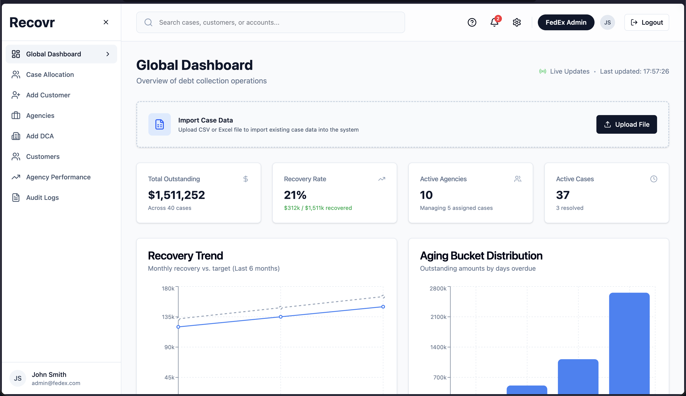
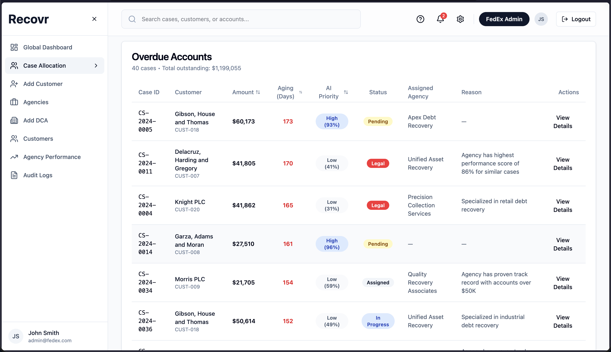
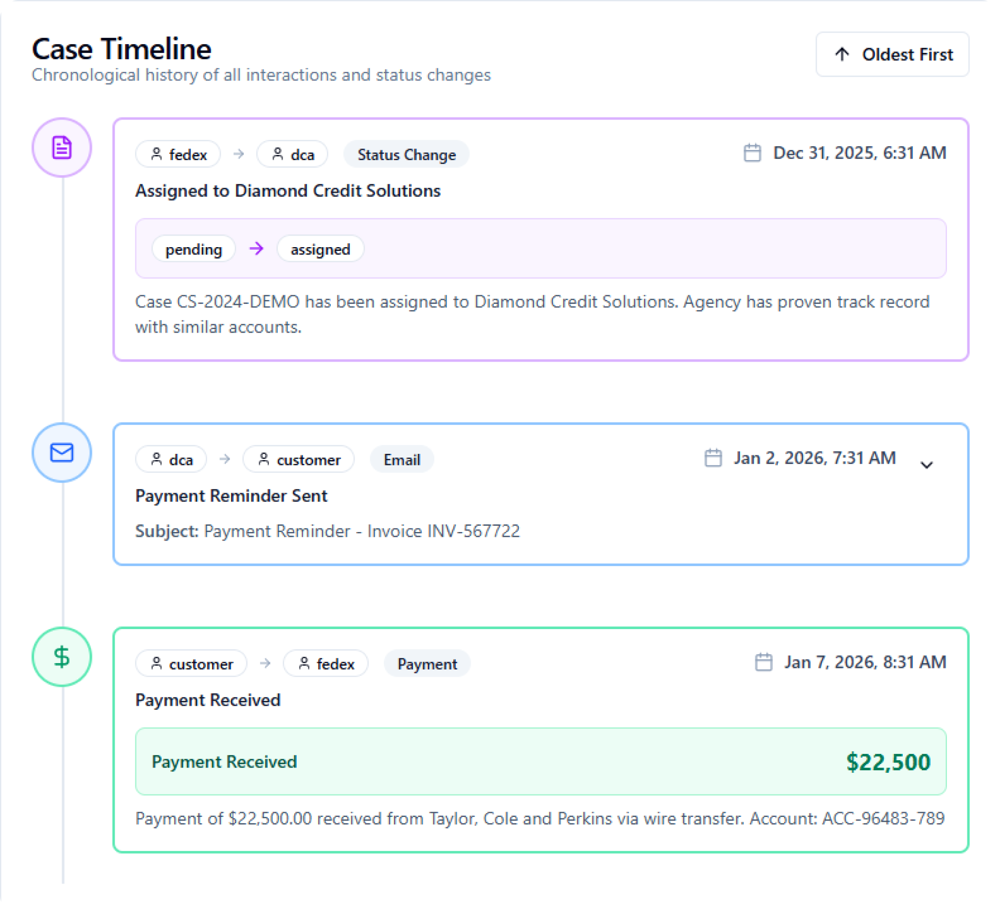
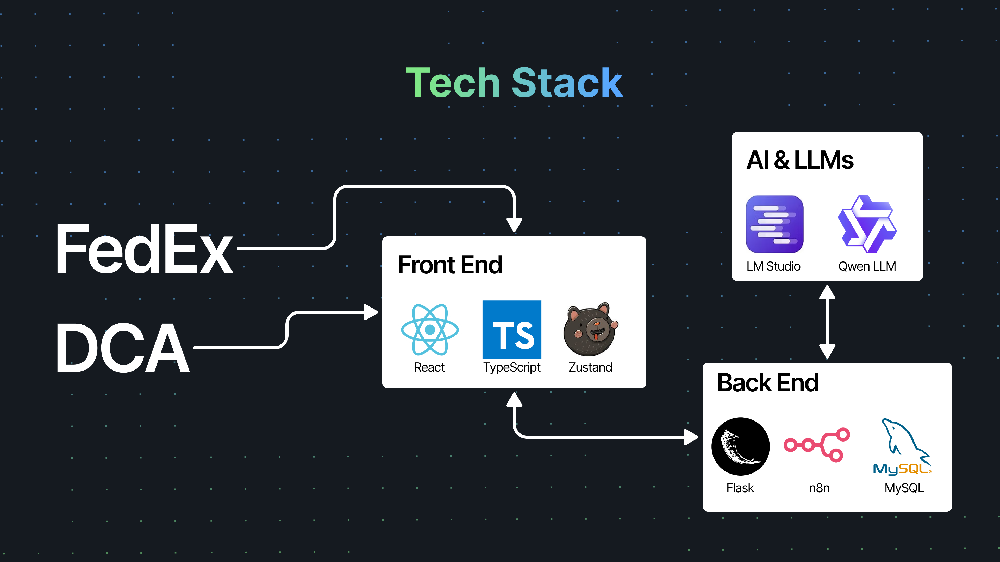

# 🟣 Recovr: Reimagining FedEx DCA Management


> **A centralised, AI driven command centre transforming Debt Collection from manual spreadsheet chaos into a precise, compliance first recovery engine.**

---

## 📑 Table of Contents
1.  [Problem Statement](#-the-problem)
2.  [The Solution](#-the-solution)
3.  [Tech Stack](#-tech-stack)
4.  [Installation & Setup](#-how-to-run-locally)
5.  [Final Outcome](#-final-outcome)

---

## 🚩 The Problem
FedEx manages thousands of overdue accounts through external Debt Collection Agencies (DCAs). Today, this process relies on:
* **The "Excel Dump":** Manual splitting of 50k+ rows takes days to allocate.
* **The "Black Hole":** Once assigned, FedEx has zero visibility into agency-customer communications.
* **"Cherry Picking":** Agencies focus on easy debts while difficult cases stagnate, with no data to prove it.

---

## ⚡ The Solution

Recovr is a unified platform designed to provide **360° visibility and automation**.

### 1. 🧠 AI Driven Smart Allocation
**Pain Point Solved:** Eliminates the manual "Excel Dump" and random assignment.
* **Solution:** Our system ingests debt cases and uses **AI ( Local LLMs )** to analyze details of the case and complexity. It automatically routes the case to the agency which is best suited for that specific case.
* **Outcome:** Allocation time reduced from days to minutes.


### 2. 🕵️‍♂️ The Event Timeline (Automated Sync)
**Pain Point Solved:** The "Black Hole" of communication.
* **Solution:** Using an **n8n workflow**, we intercept emails between the Customer and FedEx. These are parsed and instantly logged onto the FedEx dashboard.
* **Outcome:** A single source of truth. When a customer calls FedEx / DCA, the FedEx / DCA representatives have access to the entire timeline and context of the case.



---
## 🛠 Tech Stack

We utilized a modern, scalable stack focusing on rapid automation and local LLM inference.



---

## 🚀 How to Run Locally

### Prerequisites
* Node.js & npm
* Python 3.9+
* **n8n** ( Required for automation workflows )
* **LM Studio** ( Required for AI logic )

### 1. Clone the Repository & Run the application
```bash
git clone https://github.com/Better-Than-You/Recovr.git

cd recovr/frontend
npm install && npm run dev

cd ../backend
pip3 install -r requirements.txt
python3 app.py

n8n start
```

### 2. Upload the workflow json file in n8n

Upload  `./n8n/n8n-workflow.json` to n8n and setup gmail credentials

### 3. LM Studio and AI

Go to developer tab, load your desired model and start the server.

## Now, Recovr is up and running!! 


## 🎯 Final Outcome

With **Recovr**, we have successfully moved the Debt Collection process from a reactive, opaque state to a **proactive, data driven command center**. We achieved a reduction in allocation time by **~99%**, established a real time communication loop that removes the "black hole," and created a governance layer that ensures every dollar owed to FedEx is tracked, managed, and optimized for recovery.

